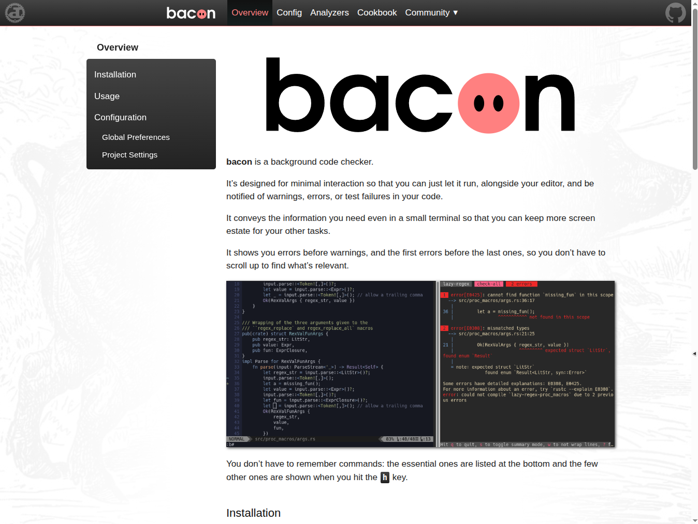

By looking at those sites and their sources, you may better see what's possible and how it's achieved.

# ddoc

Of course this site is made with ddoc.

See the source at [https://github.com/Canop/ddoc/tree/main/website](https://github.com/Canop/ddoc/tree/main/website)

# bacon

bacon's website looks a lot like the one of ddoc, except colors don't try to be neutral.

website: [https://dystroy.org/bacon](https://dystroy.org/bacon)

Source: [https://github.com/Canop/bacon/tree/main/website](https://github.com/Canop/bacon/tree/main/website)

# rhit

This site sports a different layout, with vertical navigation stripes.

website: [https://dystroy.org/rhit](https://dystroy.org/rhit)

Source: [https://github.com/Canop/rhit/tree/main/website](https://github.com/Canop/rhit/tree/main/website)
